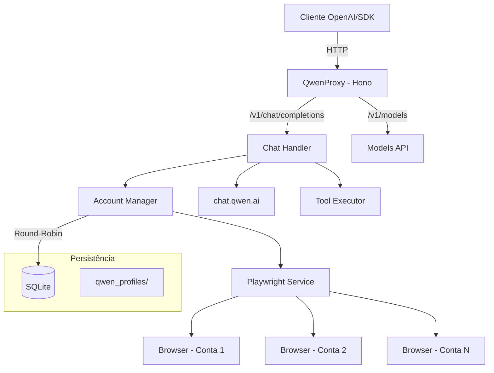

# QwenProxy

Proxy API local compatível com OpenAI que roteia requisições para os modelos do **Qwen (chat.qwen.ai)** via automação de navegador com Playwright. Suporte a múltiplas contas com rotação automática, execução de ferramentas, modo de pensamento (reasoning), persistência de sessão e armazenamento em SQLite.

[](https://github.com/pedrofariasx/qwenproxy/actions/workflows/ci.yml)
[](https://www.typescriptlang.org/)
[](https://hono.dev/)
[](https://playwright.dev/)
[](LICENSE)

---

## Features

- **OpenAI API Compatible** — Interface compatível com `/v1/chat/completions` e `/v1/models`.
- **Multi-Account** — Gerencie múltiplas contas Qwen com rotação round-robin e cooldown automático (persistido em SQLite, sobrevive a restart).
- **Qwen Paralelo** — Entrypoint adicional em `/qwen-parallel` sem mutex por conta: cria um chat novo por request e permite **múltiplos streams simultâneos na mesma conta** (ideal para orquestração multi-agente).
- **OpenRouter Proxy** — Entrypoint em `/openrouter` com pool de API keys e **throttle de RPS por key** (proativo, enfileira pra não estourar o limite). Controle manual de RPS/disable por key via console. Sem navegador — API direta.
- **SQLite Storage** — Contas salvas em banco de dados SQLite (WAL mode) para performance e confiabilidade.
- **Reasoning Support** — Suporte completo ao modo de pensamento (thinking) dos modelos Qwen.
- **Tool Execution** — Sistema de execução de ferramentas locais integrado ao fluxo do chat.
- **Session Persistence** — Perfil de navegador persistente por conta em `qwen_profiles/`.
- **Auto-Login** — Login automático via credenciais com recuperação de sessão.
- **Browser Selection** — Escolha entre Chromium, Chrome, Firefox, Edge ou WebKit.
- **Monitoring** — Health check, métricas Prometheus e watchdog integrados.
- **Docker Ready** — Deploy para VPS com Docker, volumes persistentes e graceful shutdown.

---

## Arquitetura



---

## Pré-requisitos

| Dependência | Versão Mínima | Instalação |
|------------|--------------|-----------|
| Node.js | v20.x | [nvm](https://github.com/nvm-sh/nvm) |
| npm | v9.x | Incluído com Node.js |
| Playwright | - | `npx playwright install` |
| Docker (opcional) | v24.x | [Docker Docs](https://docs.docker.com/get-docker/) |

---

## Instalação

### Via npm

```bash
git clone https://github.com/pedrofariasx/qwenproxy.git
cd qwenproxy
npm install
npx playwright install
```

### Via Docker

```bash
docker-compose up -d
```

---

## Configuração

Crie o arquivo `.env` na raiz do projeto (veja `.env.example`):

```env
# Porta do servidor (default: 3000)
PORT=3000

# Chave de API para proteger os endpoints (opcional)
API_KEY=sua-chave-secreta-aqui

# Credenciais Qwen para login automático (modo single-account)
QWEN_EMAIL=seu-email@exemplo.com
QWEN_PASSWORD=sua-senha-aqui

# Navegador (chromium, firefox, chrome, edge)
BROWSER=chromium

# OpenRouter proxy (opcional) — pool de keys separadas por vírgula.
# Habilita as rotas /openrouter. Deixe vazio para desabilitar.
OPENROUTER_KEYS=sk-or-v1-xxxx,sk-or-v1-yyyy
```

> A `API_KEY`, se definida, protege **todas** as rotas (Qwen, `/qwen-parallel` e `/openrouter`). Deixe vazia para um proxy aberto.

---

## Gerenciamento de Contas

As contas são armazenadas em SQLite (`data/qwenproxy.db`). Use o CLI interativo para gerenciar:

```bash
# Abrir o gerenciador de contas
npm run login

# Com navegador específico
npm run login:firefox
npm run login:chrome
npm run login:edge
```

O menu interativo permite:
- **[A]** Adicionar conta com credenciais (email + senha)
- **[M]** Adicionar conta via login manual no navegador
- **[R]** Remover uma conta
- **[D]** Desativar uma conta (cooldown manual — por X horas ou indefinido)
- **[E]** Reativar uma conta (remove o cooldown/desativação)
- **[L]** Login em todas as contas (inicializar sessões)

> Na primeira execução, se existir um `accounts.json` antigo, as contas serão migradas automaticamente para SQLite.

### Console interativo (servidor rodando)

Com o servidor em execução num terminal interativo, você pode desativar/reativar contas **ao vivo** (útil quando você percebe um rate-limit que a detecção automática não pegou). Basta digitar no console:

```
# Contas Qwen
list                          # lista contas + status (ativa / cooldown / desativada)
disable <email|id|#> [horas]  # desativa (sem "horas" = indefinido até reativar)
enable  <email|id|#>          # reativa a conta

# Keys OpenRouter (prefixo "or")
or list                       # keys: RPS, status e próximo slot
or rps <key|#|all> <n>        # define requisições/segundo da key (ou de todas)
or disable <key|#>            # para de usar a key
or enable  <key|#>            # volta a usar a key
help
```

Mudanças no console valem na hora. Mudanças de conta Qwen via `npm run login` (outro processo) são sincronizadas com o servidor a cada ~10s (ambos compartilham o SQLite). As keys/RPS do OpenRouter ficam em memória (default do `.env`).

---

## Uso

### Iniciar o servidor

```bash
npm start                  # Chromium (padrão)
npm run start:chrome       # Google Chrome
npm run start:firefox      # Firefox
npm run start:edge         # Microsoft Edge
```

O servidor inicia em `http://localhost:3000` com as seguintes rotas:

| Rota | Método | Descrição |
|------|--------|-----------|
| `/v1/chat/completions` | POST | Chat completions Qwen (streaming + non-streaming) |
| `/v1/chat/completions/stop` | POST | Abortar uma geração ativa |
| `/v1/models` | GET | Listar modelos disponíveis |
| `/v1/models/:model` | GET | Informações de um modelo específico |
| `/qwen-parallel/v1/chat/completions` | POST | Qwen sem mutex — streams paralelos por conta |
| `/qwen-parallel/v1/models` | GET | Modelos Qwen (via serviço paralelo) |
| `/qwen-parallel/v1/status` | GET | Status de cooldown por conta |
| `/openrouter/v1/chat/completions` | POST | OpenRouter com throttle de RPS por key |
| `/openrouter/v1/models` | GET | Modelos do OpenRouter |
| `/openrouter/v1/keys` | GET | Status das keys (RPS, disabled, próximo slot) |
| `/health` | GET | Health check com status do sistema |
| `/metrics` | GET | Métricas no formato Prometheus |

---

## Entrypoints adicionais

Além das rotas Qwen padrão (`/v1/...`), o servidor expõe dois proxies extras no **mesmo processo/porta**, cada um com seu prefixo. Aponte o `baseURL` do seu cliente OpenAI para o que precisar:

| Entrypoint | `baseURL` | Quando usar | Detalhes |
|------------|-----------|-------------|----------|
| **Qwen (padrão)** | `http://localhost:3000/v1` | Cliente conversacional único | Serializa por conta (1 stream/conta) |
| **Qwen paralelo** | `http://localhost:3000/qwen-parallel/v1` | Fan-out multi-agente | Muitos streams/conta, chat novo por request — veja [src/qwenparallel/README.md](src/qwenparallel/README.md) |
| **OpenRouter** | `http://localhost:3000/openrouter/v1` | Modelos do OpenRouter com throttle de RPS | Configure `OPENROUTER_KEYS` + `OPENROUTER_RPS` — veja [src/openrouterproxy/README.md](src/openrouterproxy/README.md) |

Todos compartilham o mesmo pool de contas/cooldowns (no caso Qwen) e a mesma `API_KEY` opcional.

---

## Exemplos de Integração

### OpenAI SDK (Node.js)

```typescript
import OpenAI from 'openai';

const openai = new OpenAI({
  baseURL: 'http://localhost:3000/v1',
  apiKey: process.env.API_KEY || 'sk-no-key-required'
});

const completion = await openai.chat.completions.create({
  model: 'qwen-plus',
  messages: [{ role: 'user', content: 'Explique como funciona o Playwright.' }]
});

console.log(completion.choices[0].message.content);
```

### cURL

```bash
curl http://localhost:3000/v1/chat/completions \
  -H "Content-Type: application/json" \
  -H "Authorization: Bearer sua-chave" \
  -d '{
    "model": "qwen-plus",
    "messages": [{"role": "user", "content": "Hello!"}],
    "stream": true
  }'
```

---

## Deploy com Docker

### docker-compose.yml

```yaml
services:
  qwenproxy:
    build: .
    container_name: qwenproxy
    ports:
      - "${PORT:-3000}:3000"
    env_file:
      - .env
    volumes:
      - ./data:/app/data               # Banco SQLite
      - ./qwen_profiles:/app/qwen_profiles  # Sessões dos navegadores
    restart: unless-stopped
```

### Volumes persistentes

| Volume | Conteúdo |
|--------|----------|
| `./data` | Banco SQLite com as contas (`qwenproxy.db`) |
| `./qwen_profiles` | Perfis de navegador por conta (cookies, sessões) |

---

## Estrutura do Projeto

```
qwenproxy/
├── src/
│   ├── index.ts                 # Entry point
│   ├── login.ts                 # CLI de gerenciamento de contas
│   ├── api/
│   │   ├── server.ts            # Servidor Hono + startup
│   │   └── models.ts            # Endpoints /v1/models
│   ├── routes/
│   │   └── chat.ts              # Handler /v1/chat/completions
│   ├── qwenparallel/            # Entrypoint Qwen paralelo (/qwen-parallel)
│   │   ├── router.ts            # Rotas + rotação sem mutex
│   │   ├── stream.ts            # Cria chat novo por request + stream
│   │   ├── prompt.ts            # Builder de prompt (isolado)
│   │   └── delta.ts             # Helper de delta incremental
│   ├── openrouterproxy/         # Proxy OpenRouter (/openrouter)
│   │   ├── router.ts            # Rotas + rotação de keys
│   │   ├── key-manager.ts       # Round-robin + cooldown por key
│   │   └── keys.ts              # Carrega OPENROUTER_KEYS do .env
│   ├── services/
│   │   ├── playwright.ts        # Automação de navegador
│   │   └── qwen.ts              # Integração com API do Qwen
│   ├── core/
│   │   ├── accounts.ts          # CRUD de contas (SQLite)
│   │   ├── account-manager.ts   # Rotação round-robin + cooldowns (persistidos)
│   │   ├── account-admin.ts     # Disable/enable manual de contas
│   │   ├── admin-console.ts     # Console interativo (disable/enable ao vivo)
│   │   ├── database.ts          # Conexão e migrations SQLite
│   │   ├── config.ts            # Configuração com Zod
│   │   ├── logger.ts            # Logger estruturado
│   │   ├── metrics.ts           # Coleta de métricas
│   │   ├── model-registry.ts    # Registro de modelos e context windows
│   │   ├── stream-registry.ts   # Tracking de streams ativos
│   │   └── watchdog.ts          # Health monitoring
│   ├── cache/
│   │   └── memory-cache.ts      # Cache em memória com TTL
│   ├── tools/
│   │   ├── executor.ts          # Execução de ferramentas
│   │   ├── registry.ts          # Registro de tools
│   │   ├── parser.ts            # Parser de <tool_call> tags
│   │   ├── schema.ts            # Validação JSON Schema
│   │   └── types.ts             # Tipos do sistema de tools
│   ├── utils/
│   │   ├── json.ts              # Parser JSON robusto
│   │   ├── context-truncation.ts # Truncamento de contexto
│   │   └── types.ts             # Re-exports de tipos
│   └── types/
│       └── openai.ts            # Tipos compatíveis com OpenAI
├── data/                        # Banco SQLite (gitignored)
├── qwen_profiles/               # Perfis de navegador por conta (gitignored)
├── Dockerfile
├── docker-compose.yml
└── package.json
```

---

## Troubleshooting

| Problema | Solução |
|----------|---------|
| Porta em uso | Altere `PORT` no `.env` ou encerre o processo na porta 3000 |
| Navegador não abre | Execute `npx playwright install` |
| Sessão expirada | Execute `npm run login` para renovar cookies |
| Rate limit em todas as contas | Adicione mais contas via `npm run login` |
| Banco corrompido | Apague `data/qwenproxy.db` e re-adicione as contas |

---

## Disclaimer

> Este projeto é fornecido estritamente para fins educacionais e de pesquisa.

Os autores não incentivam ou endossam:
- Violação dos Termos de Serviço da plataforma Qwen.
- Automação não autorizada em larga escala.
- Uso para atividades maliciosas.

**Use por sua conta e risco.**
